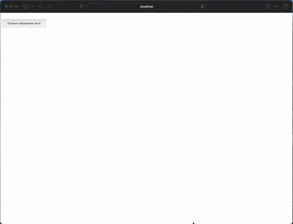

# Simple-Web-App
Simple Web Application on HTML, CSS, JS and Java Spring Boot

In this project I implemented simple web form in HTML, CSS and make server part for it on Java Spring Boot. For Database I used MySQL

To start this project on your computer:
1. Start MySQL server
2. Change username and password for datasource in file application.properties (in resources folder)
3. Lunch project in main function
4. Open form in address http://localhost:8080
